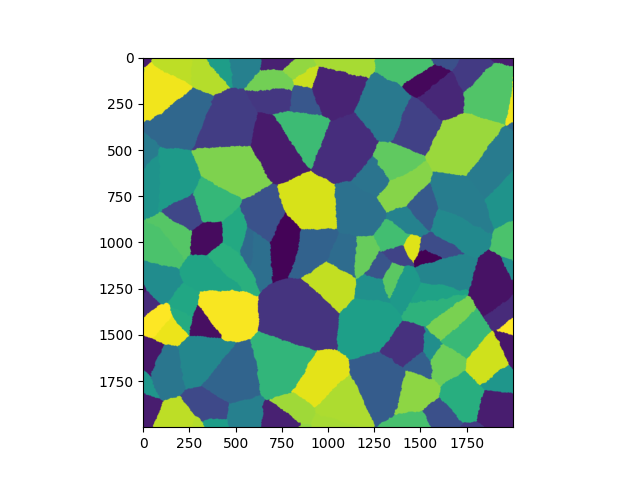

# Fast Grain Growth Simulation

A simple simulation and visualization of the crystallization process based on the Moore neighborhood. The computational solver is fully optimized using NumPy vectorization for high performance. 

## How to Start

1. Install the required dependencies:
```bash
pip install -r requirements.txt
```

2. Customize the simulation parameters (grid size and number of initial grains) at the bottom of grain_growth.py:
```python
if __name__ == '__main__':
    # GrainSimulation(length, width, num_grains)
    my_sim = GrainSimulation(200, 200, 50)
```

## Run the script
```bash
python grain_growth.py
```

## Result
