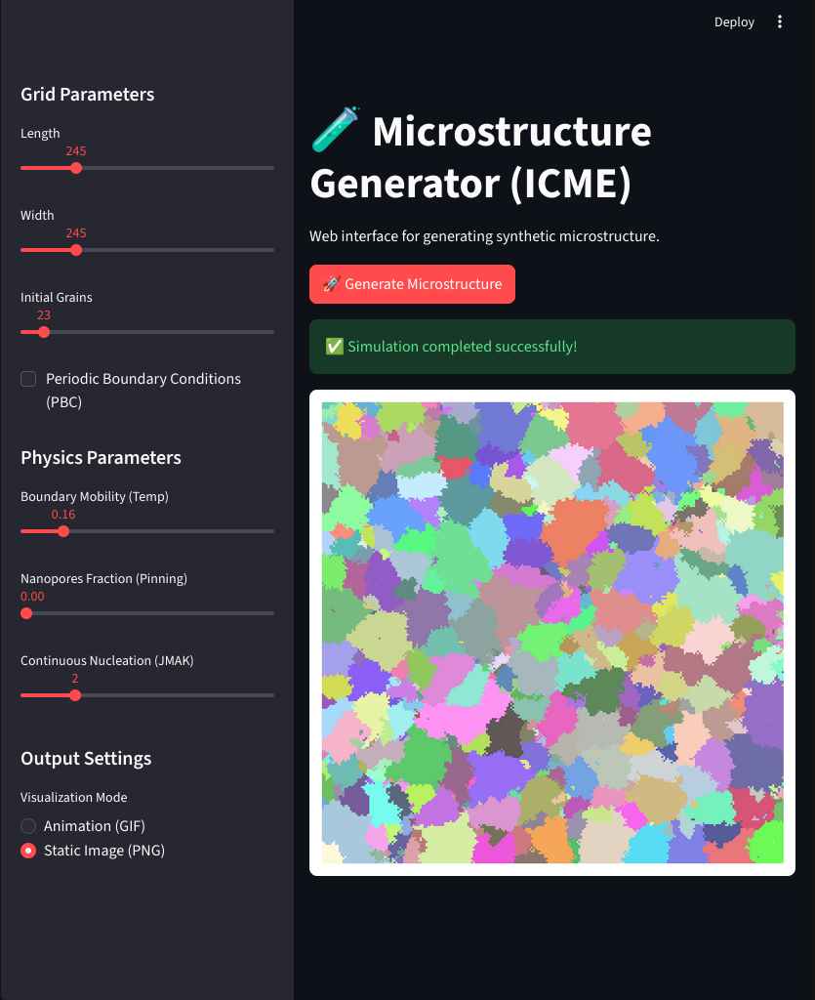
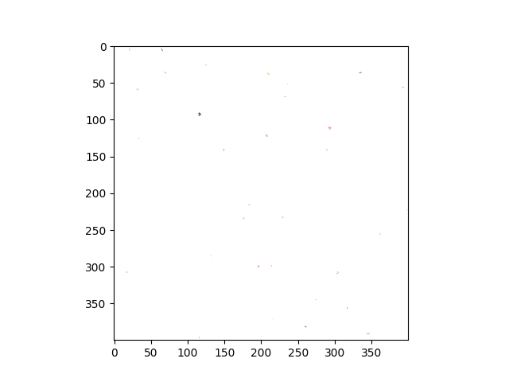

# Microstructure Evolution Generator (ICME)

A high-performance, Python-based scientific simulation of microstructure evolution and crystallization. Designed as a synthetic data generator for Machine Learning models in materials science (e.g., Ultra-Fine Grained metals, porosity analysis). 



## ✨ Core Features

* **Dual Interface**: Run via Command Line (CLI) for batch processing or through the interactive **Streamlit Web App**.
* **High Performance**: Pure NumPy tensor operations (no nested `for` loops) using the Moore neighborhood.
* **Advanced Physics Engine**: 
  * **Boundary Mobility (Temperature)**: Stochastic cellular automata approach for grain growth.
  * **Zener Pinning**: Simulate insoluble particles or nanopores that restrict boundary movement.
  * **JMAK Kinetics**: Continuous nucleation of new grains during the cooling process.
  * **Boundary Conditions**: Toggle between Periodic Boundary Conditions (PBC) and Hard Walls.

## 🚀 How to Run

### 1. Installation
Clone the repository and install the required dependencies:
```bash
pip install -r requirements.txt
pip install streamlit
```

### 2. Web Interface
Launch the interactive dashboard to adjust parameters in real-time and export structures:
```bash
streamlit run app.py
```

### 3. Command Line Interface (CLI)
For background generation or headless environments.

**Basic Run (Live Animation):**
```bash
python grain_growth.py --length 200 --width 200 --grains 50 --mobility 0.8
```

**Generate Final Structure with Nanopores (Static PNG):**
```bash
python grain_growth.py --mode static --length 300 --width 300 --pinning 0.05 --pbc
```

**CLI Arguments:**
* `--length` / `--width` (int): Grid dimensions.
* `--grains` (int): Number of initial grains.
* `--mode` (str): `animate` (default), `static`, or `save`.
* `--pbc`: Flag to enable Periodic Boundary Conditions.
* `--nucl_rate` (int): Number of new grains spawning per step.
* `--pinning` (float): Fraction of pinning particles/pores (0.0 to 1.0).
* `--mobility` (float): Probability of boundary movement per step (0.0 to 1.0).
* `--file_name` (str): Name of your file.
## 🔬 Physics in Action
*Example of grain growth with Continuous Nucleation:*

